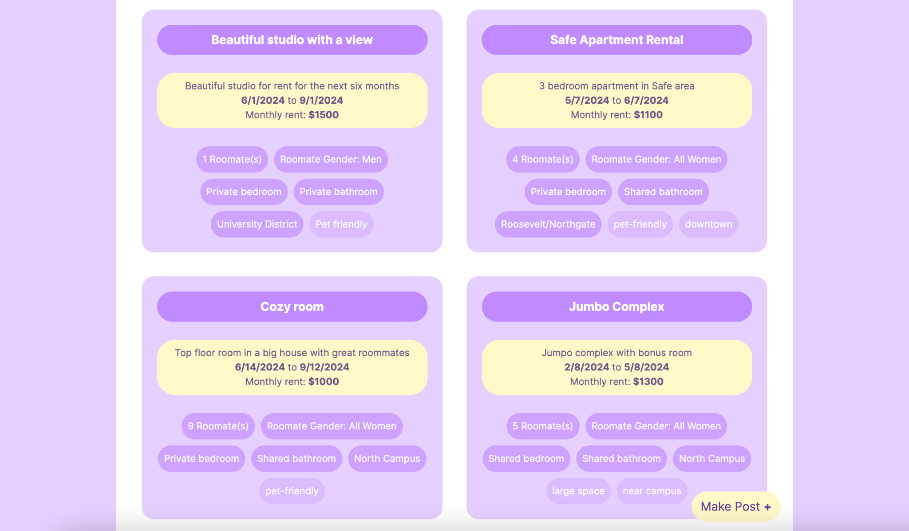
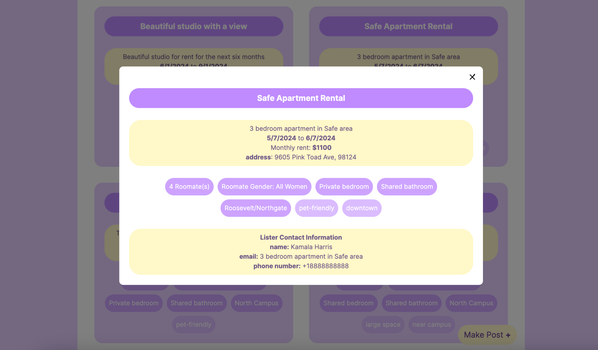
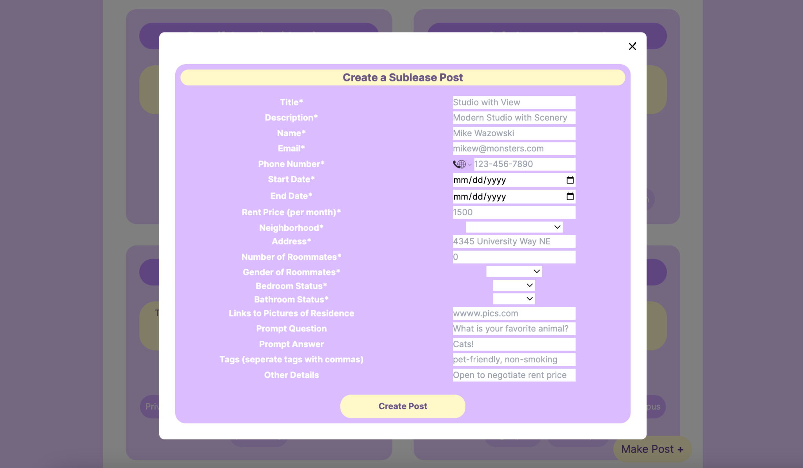

## A & B: Description & Screenshots

### Functionality 1: Viewing Listing Posts

With this functionality users can view listing posts on Dublease. On the homepage they will see a feed with previews/basic information about each listing. Upon clicking any listing they will see a popup with more information.

**Github Issues**

- [[#11] Backend - get_listing_posts endpoint](https://github.com/UWSocialComputing/husky-hackers-code/issues/11)

- Code:

- backend/app.py

- backend/db.py

- [[#9] Frontend - Viewing listing posts](https://github.com/UWSocialComputing/husky-hackers-code/issues/9)

- Code:

- frontend/dublease/app/page.js

- frontend/dublease/app/service.js

- frontend/dublease/app/components/popup.js

- frontend/dublease/app/components/listingPostCard.js

**Screenshots:**

### Functionality 2: Make Listing Posts

With this functionality users can make listing posts on Dublease. Upon clicking a “Make Post” button on the homepage they will be able enter the post information in a popup window and have it saved to our backend.

**Github Issues**

- [[#12] Backend - make_listing_post endpoint](https://github.com/UWSocialComputing/husky-hackers-code/issues/12)

- Code:

- backend/app.py

- backend/db.py

- [[#10] Frontend - Make listing posts](https://github.com/UWSocialComputing/husky-hackers-code/issues/10)

- Code:

- frontend/dublease/app/components/makePost.js

- frontend/dublease/app/components/popup.js

**Screenshots:**

Other functionalities (e.g., filtering and sorting) were omitted and will be implemented over the coming week.

## C: User Testing

#### What did you learn in the user testing sessions?

Through the user testing sessions, we learned that our functionality is good, but there are a lot of design tweaks that we can make to make the functionality more obvious/easy to use. Some of this feedback is highlighted below:

Feedback about viewing listing posts:

- The color palette is a little too overwhelming and hard to read, because it’s too much purple (and purple on white is hard to read)

- Users expected that when you view a post it either opens a bigger popup or leads to a new page (so that they can open a bunch of listing posts in new tabs)

- It’s not clear that in order to get more information about a listing post you need to click on it (we need to somehow emphasize this by having some hovering functionality or having a button that says “expand”)

- Because we use bubbles to show the fields, it’s not clear which fields have static options (e.g., the roommate gender dropdown where the options are all men/all women/mixed) versus which fields are freeform text (e.g. prompt questions)

Feedback about making listing posts:

- Easier way to input tags

- Having default tags that users can add

- Custom tags input to follow the more traditional approach that is already widely used (input tag and enter to create bubble)

- Debugging - “All men” appears twice gender dropdown

- Make mandatory fields obvious

- Add dropdown options for prompts

- Add “flexible dates” and “flexible rent” option (checkbox)

Overall, our feedback shows that some of our design decisions make the functionality/user flow a little unclear, i.e. users don’t immediately know how to do certain tasks that they want to do. So, we plan to update our UI based on this feedback so that the UI is super easy to use for new users.

#### Are the findings promising enough that you would like to go ahead with the current functionality of the prototype? (If yes, describe why, if no, describe what changes you are proposing to make.)

Yes, the findings are promising enough that we would like to go ahead with the current functionality of the prototype. This is because the feedback that we received during the user testing was mostly related to design aspects in order to make the functionality more obvious/easy to follow–we didn’t really get any critiques on the functionality itself.

#### What are the next functionalities that you will implement in your prototype?

The next functionalities that we will implement in our prototype are:

1. Being able to filter posts based on the fields (e.g., filter for only private bedroom and private bathroom residences or women-only residences)

2. Being able to add photos to the actual posts instead of just links to photos

3. Being able to sort posts based on the fields (e.g., sort from lowest price to highest price)
