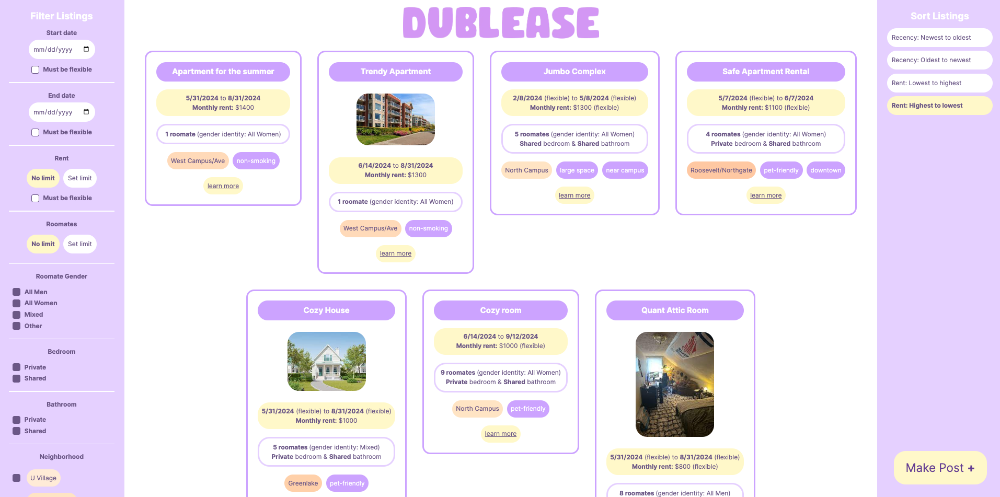
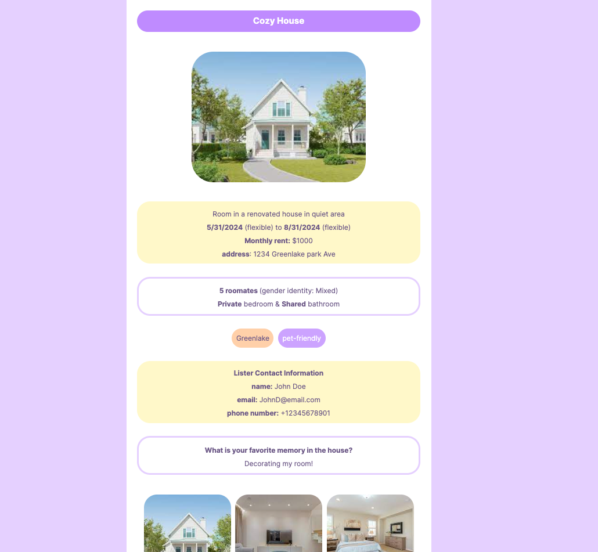
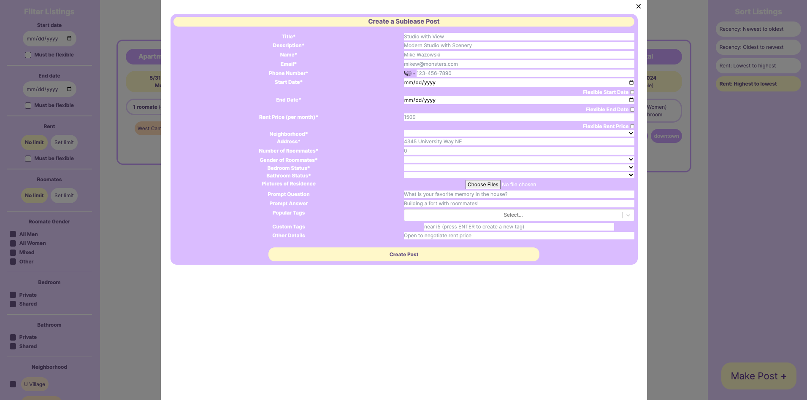
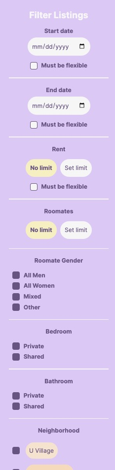
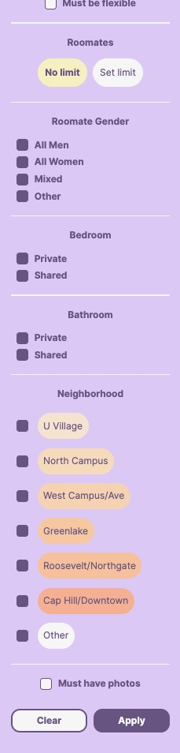

# Digital Prototype

## Problem and Audience

With the lack of platforms available that are efficient in connecting individuals looking to sublease spaces to those who are looking to rent, and current platforms being used for this purpose being inadequate and insufficient to fully support this need, we developed a platform with features that alleviate the pain points and support needs of users. Our primary target audiences are individuals who have residences and are looking to sublease or relet, and collectively, individuals looking to sublease housing. These areas are solely restricted to University District, and would be focused towards single rooms or apartments for lease rather than larger spaces.

## Prototype

[Repository Link](https://github.com/UWSocialComputing/husky-hackers-code)

### Design

The prototype was designed to allow users to interact with the service without creating profiles, enabling them to act as both listers sharing available leases and tenants searching for leases. Optional "ice-breaker" questions let listers share fun information about themselves and the residence to build trust and credibility. Communication happens through user-chosen platforms, with the option to provide contact details. Usability and intuitive design were prioritized based on user feedback, with color coding, high contrast, large interactable targets, and common visual signs. When creating posts, placeholders provide hints and examples for expected information. Required fields like title, description, name, and email are validated, with error checks for dates, input types, and dropdown options. Error messages prevent posts with inaccurate input from being submitted. These design choices aimed to make the platform easy to use and the post creation process seamless and efficient.

### Technical

##### Frontend

The frontend is a Next JS React app. The main page displays a summary of all listings from the database as mini tiles with key details like title, lease dates, price, bed/bath status, roommate status, tags, and a main image if provided. A "Learn More" button opens a separate page with the full listing details including contact information, ice-breaker responses, additional details, and all images. On the main page, users can filter listings by date range, rent amount, number of roommates, roommate gender, bed/bath, neighborhood, and availability of images. The right sidebar allows sorting listings by recency or rent amount. A "Make Post" button at the bottom right lets users create new listings by populating lease information across various fields and uploading residence images.

##### Backend

Our backend is a Flask API that connects to a MongoDB database. The API and database support making posts (adds an entry to the database), viewing all posts, viewing posts with filters such as price or number of roommates, and querying a single post by its ID.

### Technical Challenges and Pivots

##### Overall

Originally, we wanted to allow both listers and potential tenants to make posts. We had hoped that this bi-directional sharing would encourage connections between listers and tenants as well as create a more genuine and comfortable experience. Due to time constraints, we were unable to implement tenant posts into our prototype. However, we imagine that the implementation of this feature will be very similar to that of creating, viewing, and filtering through listing posts as they share similar structures and flows.

##### Frontend

While getting familiar with the React environment and toolset required extensive documentation research and external resources, we did not face major challenges that forced us to change our chosen toolset. Issues like listings not automatically rendering after new posts, limitations with input libraries when making posts, and layout edge cases for long inputs and popup lengths were addressed through debugging, workarounds, and exploring CSS attributes, styles, and available extensions. Our focus on an appealing and easy-to-navigate layout motivated us to leverage existing tools effectively to mitigate these types of issues.

##### Backend

Although we did not make any explicit pivots in our backend development, we ran into one challenge. The challenge was in figuring out how to add support for listings posts with images. Typically, almost all listings posts will have images, because in order for a lister to successfully find a tenant they need to show what the property looks like in the post. However, the typical way to do this with a database is to store images in a file storage service (e.g., AWS S3). We did not want to use this approach because setting up a file storage service would be a lot of overhead for posts with typically not too many images (and we also didn’t expect that the image files would be too big). So, the solution that we came up with was to directly store the images associated with each post in the database, using Binary JSON (BSON) format.

### Artifacts

#### Home/Main Page:

#### Viewing a Post:

#### Making a Post:

#### Filters:

